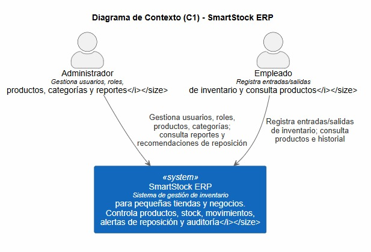

# 3 Context and Scope

## 3.1 Alcance del Sistema

En esta primera versión, el sistema está enfocado principalmente en el **Módulo de Gestión de Movimientos de Inventario**, permitiendo registrar entradas y salidas de productos, consultar el historial de movimientos y mantener la trazabilidad de las operaciones realizadas por los usuarios

Los actores externos que interactúan con el sistema son:

- **Administrador:** responsable de la administración general del sistema, incluyendo la gestión de usuarios, roles, productos, categorías, reportes y recomendaciones de reposición.
- **Empleado:** encargado de registrar los movimientos de inventario (entradas y salidas) y consultar la información de los productos y su historial.

No existen integraciones con sistemas externos en esta primera versión; toda la información es administrada dentro de SmartStock ERP.

---

## 3.2 Diagrama de Contexto (C1)

El siguiente diagrama representa el contexto del sistema utilizando el modelo **C4 - Nivel 1 (Context Diagram)**. En el se identifican los actores externos que interactúan con SmartStock ERP y las principales funciones que realizan dentro del sistema

**Figura 3.1.** Diagrama de Contexto (C1) de SmartStock ERP.

---
