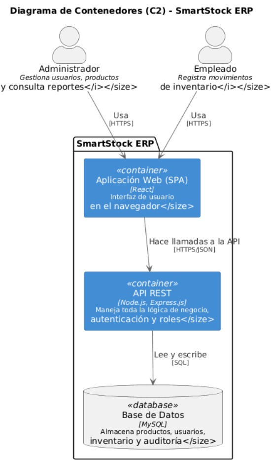

# 5. Building Block View

## 5.1 Visión General

La arquitectura de SmartStock ERP sigue una arquitectura en capas basada en el patrón **MVC (Model-View-Controller)**. El sistema se encuentra dividido en contenedores que separan la interfaz de usuario, la lógica de negocio y el almacenamiento de la información, facilitando el mantenimiento, la escalabilidad y la reutilización del código.

El siguiente diagrama representa los principales contenedores del sistema y la interacción entre ellos.

## 5.2 Diagrama de Contenedores (C2)

**Figura 5.1.** Diagrama de Contenedores (C2) de SmartStock ERP.

---

## 5.3 Responsabilidad de cada contenedor

| Contenedor | Responsabilidad |
|------------|-----------------|
| **Usuario (Administrador / Empleado)** | Interactúa con el sistema mediante la interfaz web para gestionar el inventario y consultar información según sus permisos |
| **Aplicación Web (ASP.NET Core MVC)** | Proporciona la interfaz gráfica del sistema, recibe las solicitudes de los usuarios y presenta la información obtenida del servidor |
| **Lógica de Negocio (Servicios)** | Implementa las reglas del negocio, valida la información recibida y ejecuta procesos como el cálculo de alertas de reposición, actualización del stock y auditoría de movimientos |
| **Entity Framework Core** | Actúa como ORM, permitiendo el acceso a la base de datos mediante entidades sin necesidad de escribir consultas SQL manualmente |
| **Base de Datos SQL Server** | Almacena permanentemente la información del sistema, incluyendo usuarios, productos, categorías, proveedores, movimientos de inventario, auditorías y configuraciones |

---

## 5.4 Comunicación entre los contenedores

El usuario interactúa con la aplicación web mediante un navegador. Las solicitudes son procesadas por ASP.NET Core MVC, que delega la lógica correspondiente a los servicios de negocio. Estos servicios utilizan Entity Framework Core para acceder a SQL Server, donde se almacena toda la información del sistema. Por ultimo los resultados son enviados nuevamente a la interfaz para ser presentados al usuario 