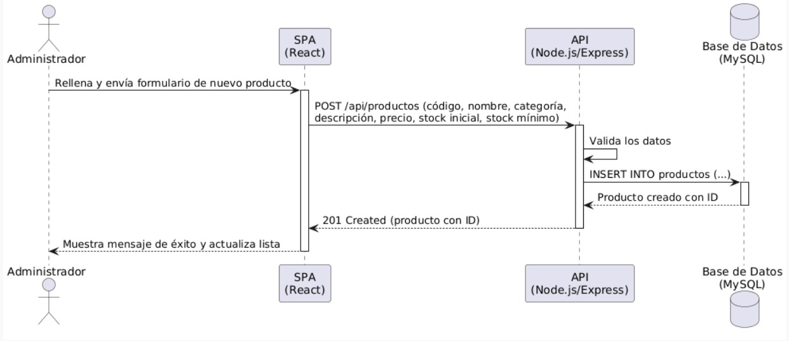

# 6. Runtime View

## 6.1 Escenario: Registrar un Producto

Uno de los procesos más importantes del sistema corresponde al registro de un nuevo producto dentro del inventario. Durante este proceso intervienen el usuario administrador, la aplicación web, la lógica de negocio y la base de datos.

El siguiente diagrama de secuencia representa el flujo de ejecución del proceso.

## 6.2 Diagrama de Secuencia

**Figura 6.1.** Diagrama de secuencia para el registro de un producto.

---

## 6.3 Descripción del flujo

El proceso de registro de un producto se desarrolla de la siguiente manera:

1. El **Administrador** accede al formulario de registro de productos desde la aplicación web.

2. El administrador diligencia la información del producto (código, nombre, categoría, descripción, precio, stock inicial y stock mínimo) y envía el formulario.

3. La aplicación web envía la solicitud al controlador correspondiente.

4. El controlador delega la operación al servicio de negocio.

5. El servicio valida que la información sea correcta y verifica que no exista previamente un producto con el mismo código.

6. Si la validación es exitosa, Entity Framework Core registra el nuevo producto en la base de datos SQL Server.

7. La base de datos confirma la creación del registro y retorna el identificador del nuevo producto.

8. La aplicación informa al usuario que el producto fue registrado correctamente y actualiza automáticamente la lista de productos.

---

## 6.4 Resultado esperado

Al finalizar el proceso:

- El nuevo producto queda almacenado en la base de datos.
- El inventario se encuentra actualizado.
- El usuario recibe una confirmación de la operación.
- El registro queda disponible para futuras operaciones de inventario.